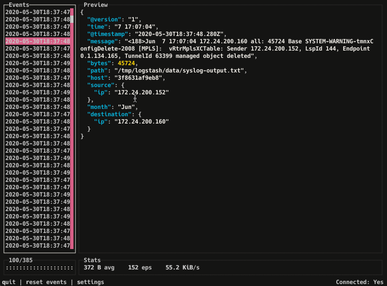

# docker-logstash-http-debug

This is a small docker image to help on coding pipelines for Logstash. It starts a webserver so you can `output` events to it, and provides a navigable console where you can inspect the pretty-printed events.



<video autoplay loop muted playsinline>
    <source src="doc/logstash-http-debug.mp4" type="video/mp4">
    <p>Your browser doesn't support this embedded video.</p>
</video>


## Getting started

### Step 1: Add or change the `output` of your pipeline:

You can use `localhost` or the name of the container (e.g. `logstash-debug`) as the url in case you are running Logstash inside docker as well.

```
output {
    ...
    http {
        url => "http://localhost:9000"
        http_method => "post"
    }
}
```


### Step 2: Start the container
Give it a very creative name such as `logstash-debug`:
```
docker run --name logstash-debug -p 9000:9000 ugosan/logstash-http-debug:latest
```

### Step 3: Start the console
On a different terminal, execute the `console.sh` to open up the UI
```
docker exec -it logstash-debug /console.sh 
```

